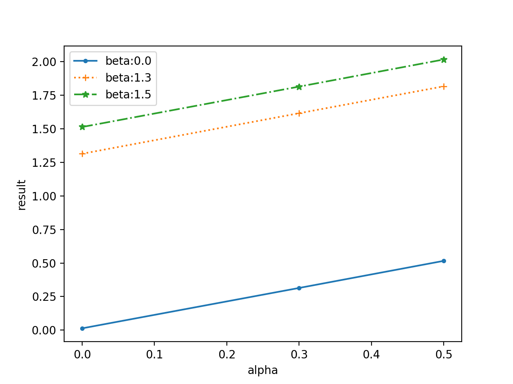

# TuneTools

A powerful tuning and result management toolkit for AI experiments.

## Examples

### Training and Tuning

#### Write a simple python code

```python
# train.py
from tunetools import decorator, Parameter

@decorator.main(num_sample=3) # each experiment will rerun for 5 times.
def main(
        # Register the hyper-parameters manifest here. 
        alpha: Parameter(default=0.5, domain=[0, 0.3, 0.5]),
        beta: Parameter(default=1, domain=[0, 1, 2]),
        lr: Parameter(default=0.001, domain=[0.01, 0.001, 0.0001]),
        dataset: Parameter(default="d1", domain=["d1", "d2", "d3"]),
        model: Parameter(default="baseline", domain=["baseline", "model1", "model2"]),
        gpu: Parameter(default=0, domain=[0])
):
    # Do training here, use all the parameters...
    import random
    return {
        "result": alpha + beta + lr + (0 if model == 'baseline' else -0.5) + random.random() / 100
    }

@decorator.filtering
def filter_func(alpha, beta, lr, dataset, model, gpu):
    # Filter some parameter combinations you don't want to use.
    return dataset != 'd3'
```

#### Test Training
```bash
# Execute train_func once by default values.
$ tunetools test train.py
========TEST========
alpha: 0.5
beta: 1
lr: 0.001
dataset: d1
model: baseline
gpu: 0
====================
result: {'result': 1.5036850040252028}

# Force some parameters to specified values, rather than default values
$ tunetools test train.py --inject beta:0 lr:0.1
========TEST========
alpha: 0.5
beta: 0
lr: 0.1
dataset: d1
model: baseline
gpu: 0
====================
result: {'result': 0.6070225725208191}
```

> `tunetools test` will not save the training results.


#### Run Training
```bash
# First, check the plan list of hyper-parameter grid searching before running.
$ tunetools plan train.py
common parameter: gpu, {0}
(2/2) {'alpha': 0, 'beta': 0, 'lr': 0.01, 'dataset': 'd1', 'model': 'baseline'}
(2/2) {'alpha': 0, 'beta': 0, 'lr': 0.01, 'dataset': 'd1', 'model': 'model1'}
...
(2/2) {'alpha': 0.5, 'beta': 2, 'lr': 0.0001, 'dataset': 'd2', 'model': 'model1'}
(2/2) {'alpha': 0.5, 'beta': 2, 'lr': 0.0001, 'dataset': 'd2', 'model': 'model2'}

162 tasks / 324 samples will be executed.
324 samples will be inserted.

# Now you can run tasks for hyper-parameter grid search.
$ tunetools run train.py

# Force some parameters to specified values.
$ tunetools plan train.py --inject beta:0 lr:0.1
common parameter: beta, {'0'}
common parameter: lr, {'0.1'}
common parameter: gpu, {0}
(2/2) {'alpha': 0, 'dataset': 'd1', 'model': 'baseline'}
(2/2) {'alpha': 0, 'dataset': 'd1', 'model': 'model1'}
...
(2/2) {'alpha': 0.5, 'dataset': 'd2', 'model': 'model1'}
(2/2) {'alpha': 0.5, 'dataset': 'd2', 'model': 'model2'}

162 tasks / 324 samples will be executed.
324 samples will be inserted.

$ tunetools plan train.py --inject beta:0 lr:0.1
```


You can run "tunetools run" in different terminals, to do a parallel training. TuneTools will ensure the synchronization between processes.
During training, you can monitor the training progress or terminate it.

```bash
$ cd $PATH_TO_ROOT_DIR
$ tunetools status
Running: 4, Pending: 16
Speed: 2.742545/h
Left Time: 6h33min (Sun Jul 18 04:35:56 2021)
$ tunetools terminate
Terminate: id = 0, host = COMPUTER, pid = 1000
Terminate: id = 1, host = COMPUTER, pid = 1001
```

### Result Management

#### Merge the result

First, write a config file describing what you want to explore in the results.
```yaml
# config.yml
target:
  - result
group_by:
  - alpha
  - beta
  - lr
where:
  - param_dataset: 'd1'
  - param_model: 'model2'
  - param_alpha: 0
```

Then you can see the results easily, including the sample count and standard deviations!

```bash
$ tunetools statistics config.yml
```

```
                               result
alpha beta lr
0.0   0    0.0001  [2] -0.4914±0.0005
           0.0010  [2] -0.4914±0.0019
           0.0100  [2] -0.4838±0.0004
      1    0.0001   [2] 0.5061±0.0028
           0.0010   [2] 0.5101±0.0007
           0.0100   [2] 0.5174±0.0011
      2    0.0001   [2] 1.5073±0.0019
           0.0010   [2] 1.5023±0.0011
           0.0100   [2] 1.5118±0.0011
```

#### Find the best parameter (tuning)

```yaml
# config.yml
target:
  - max: result # (or min: result)
group_by:
  - dataset
  - model
find_best:
  - alpha
  - beta
  - lr
```

Then, you can find the best `alpha`, `beta` and `lr`, for maximizing `result`.

```bash
$ tunetools statistics config.yml
```

```
                                             result
dataset model    alpha beta lr
d1      baseline 0.5   2    0.01  [2] 2.5133±0.0000
        model1   0.5   2    0.01  [2] 2.0129±0.0025
        model2   0.5   2    0.01  [2] 2.0141±0.0024
d2      baseline 0.5   2    0.01  [2] 2.5121±0.0015
        model1   0.5   2    0.01  [2] 2.0173±0.0020
        model2   0.5   2    0.01  [2] 2.0115±0.0011
```

#### T-test just in several lines of codes!

```yaml
# config.yml
target:
  - max: result
group_by:
  - dataset
  - model
find_best:
  - alpha
  - beta
  - lr
t_test:
  - baseline: # specify the baseline
      - model: 'baseline'
      - dataset: 'd1'
  - equal_var: True
```

Then, you can see the p-value in the result, contained in parentheses.

```bash
$ tunetools statistics config.yml
```

```
                                                      result
dataset model    alpha beta lr
d1      baseline 0.5   2    0.01  [2] 2.5133±0.0000 (1.0000)
        model1   0.5   2    0.01  [2] 2.0129±0.0025 (0.0000)
        model2   0.5   2    0.01  [2] 2.0141±0.0024 (0.0000)
d2      baseline 0.5   2    0.01  [2] 2.5121±0.0015 (0.5031)
        model1   0.5   2    0.01  [2] 2.0173±0.0020 (0.0000)
        model2   0.5   2    0.01  [2] 2.0115±0.0011 (0.0000)
```

#### Draw a nice figure just in several lines of codes!

```yaml
# config.yml
target:
  - result
group_by:
  - alpha
  - beta
where:
  - param_dataset: 'd1'
  - param_lr: 0.01
  - param_model: "baseline"
draw:
  - x: alpha
  - y: result
  - legend: beta=${param_beta}
```

```bash
$ tunetools statistics config.yml
```



## Installation

```bash
pip install tunetools
```

## License
```
MIT License

Copyright (c) 2021 Chen Mouxiang

Permission is hereby granted, free of charge, to any person obtaining a copy
of this software and associated documentation files (the "Software"), to deal
in the Software without restriction, including without limitation the rights
to use, copy, modify, merge, publish, distribute, sublicense, and/or sell
copies of the Software, and to permit persons to whom the Software is
furnished to do so, subject to the following conditions:

The above copyright notice and this permission notice shall be included in all
copies or substantial portions of the Software.

THE SOFTWARE IS PROVIDED "AS IS", WITHOUT WARRANTY OF ANY KIND, EXPRESS OR
IMPLIED, INCLUDING BUT NOT LIMITED TO THE WARRANTIES OF MERCHANTABILITY,
FITNESS FOR A PARTICULAR PURPOSE AND NONINFRINGEMENT. IN NO EVENT SHALL THE
AUTHORS OR COPYRIGHT HOLDERS BE LIABLE FOR ANY CLAIM, DAMAGES OR OTHER
LIABILITY, WHETHER IN AN ACTION OF CONTRACT, TORT OR OTHERWISE, ARISING FROM,
OUT OF OR IN CONNECTION WITH THE SOFTWARE OR THE USE OR OTHER DEALINGS IN THE
SOFTWARE.

```