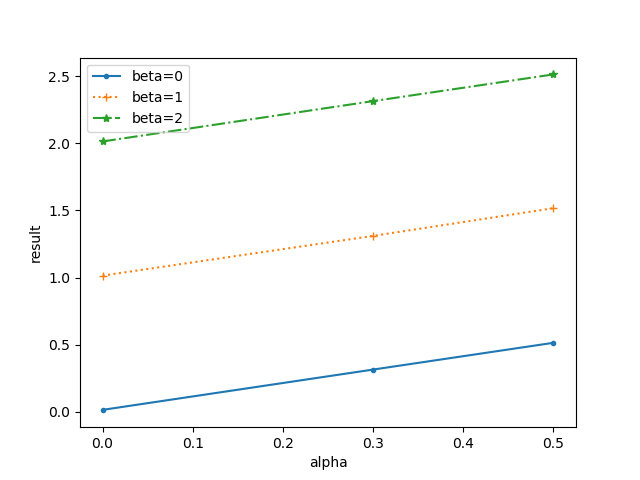

# TuneTools

A powerful tuning and result management toolkit for AI experiments.

> Under Construction

## Examples

### Training and Tuning

#### Write a simple python code

```python
# train.py
import random
import tunetools as tt

def train_func(x):
    # get training parameters from x (dict)
    alpha, beta, lr, model = x['alpha'], x['beta'], x['lr'], x['model']
    # do some training...
    return {
        "result": alpha + beta + lr + (0 if model == 'baseline' else -0.5) + random.random() / 100
    }

# Parameter menifest and corresponding domain.
search_spaces = [
    tt.GridSearchSpace("alpha", default=0.5, domain=[0, 0.3, 0.5]),
    tt.GridSearchSpace("beta", default=1.5, domain=[0, 1.3, 1.5]),
    tt.GridSearchSpace("lr", default=0.001, domain=[0.01, 0.001, 0.0001]),
    tt.GridSearchSpace("model", default="baseline", domain=["baseline", "model1", "model2"]),
    tt.GridSearchSpace("dataset", default="d1", domain=["d1", "d2", "d3"])
]

# Filter some parameter combinations if necessary.
def filter_func(x):
    return x['dataset'] != 'd3'

# Start!
tt.test_or_run(obj_function=train_func, filter_function=filter_func, num_sample=5, parameters=search_spaces)
```

#### Test Training
```bash
# Execute train_func by default values.
python train.py --test

# Force some parameters to a specified value, rather than default values
python train.py --test --beta 1.3 --lr 0.1
```

> `--test` argument will not save the training results.


#### Run Training
```bash
# Create tasks for each parameter combination. 
# You can run the following command for many times, to do a parallel training. 
# TuneTools will ensure the synchronization between processes.
$ python train.py

# Force some parameters to a specified value.
$ python train.py --beta 1.3 --lr 0.1
```

During training, you can monitor the training progress or terminate it.

```bash
$ cd $PATH_TO_ROOT_DIR
$ tunetools status
Running: 4, Pending: 16
Speed: 2.742545/h
Left Time: 6h33min (Sun Jul 18 04:35:56 2021)
$ tunetools terminate
Terminate: id = 0, host = COMPUTER, pid = 1000
Terminate: id = 1, host = COMPUTER, pid = 1001
```

### Result Management

#### Merge the result

First, write a config file describing what you want to explore in the results.
```yaml
# config.yml
target:
  - result
group_by:
  - alpha
  - beta
  - lr
where:
  - param_dataset: 'd1'
  - param_model: 'model2'
  - param_alpha: 0
```

Then you can see the results easily, including the sample count and standard deviations!

```bash
$ tunetools statistics --config config.yml
```

```
   param_alpha  param_beta  param_lr         ret_result
0          0.0         0.0    0.0001  [5] 0.0037±0.0022
1          0.0         0.0    0.0010  [5] 0.0069±0.0032
2          0.0         0.0    0.0100  [5] 0.0137±0.0011
3          0.0         1.3    0.0001  [5] 1.3045±0.0020
4          0.0         1.3    0.0010  [5] 1.3065±0.0025
5          0.0         1.3    0.0100  [5] 1.3135±0.0027
6          0.0         1.5    0.0001  [5] 1.5039±0.0030
7          0.0         1.5    0.0010  [5] 1.5053±0.0026
8          0.0         1.5    0.0100  [5] 1.5127±0.0027
```

#### Find the best parameter (tuning)

```yaml
# config.yml
target:
  - max: result # (or min: result)
group_by:
  - dataset
  - model
find_best:
  - alpha
  - beta
  - lr
```

Then, you can find the best `alpha`, `beta` and `lr`, for maximizing `result`.

```bash
$ tunetools statistics --config config.yml
```

```
  param_dataset param_model  param_alpha  param_beta  param_lr         ret_result
0            d1    baseline          0.5         1.5      0.01  [5] 1.5135±0.0031
1            d1      model1          0.5         1.5      0.01  [5] 2.0127±0.0013
2            d1      model2          0.5         1.5      0.01  [5] 2.0149±0.0034
3            d2    baseline          0.5         1.5      0.01  [5] 1.5149±0.0029
4            d2      model1          0.5         1.5      0.01  [5] 2.0161±0.0017
5            d2      model2          0.5         1.5      0.01  [5] 2.0134±0.0019
6            d3    baseline          0.5         1.5      0.01  [5] 1.5128±0.0015
7            d3      model1          0.5         1.5      0.01  [5] 2.0159±0.0041
8            d3      model2          0.5         1.5      0.01  [5] 2.0147±0.0033
```

#### T-test in one code

```yaml
# config.yml
target:
  - max: result
group_by:
  - dataset
  - model
find_best:
  - alpha
  - beta
  - lr
t_test:
  - baseline: # specify the baseline
      - model: 'baseline'
      - dataset: 'd1'
  - equal_var: True
```

Then, you can see the p-value in the result, contained in parentheses.

```bash
$ tunetools statistics --config config.yml
```

```
  param_dataset param_model  param_alpha  param_beta  param_lr                  ret_result
0            d1    baseline          0.5         1.5      0.01  [5] 1.5135±0.0031 (1.0000)
1            d1      model1          0.5         1.5      0.01  [5] 2.0127±0.0013 (0.0000)
2            d1      model2          0.5         1.5      0.01  [5] 2.0149±0.0034 (0.0000)
3            d2    baseline          0.5         1.5      0.01  [5] 1.5149±0.0029 (0.5374)
4            d2      model1          0.5         1.5      0.01  [5] 2.0161±0.0017 (0.0000)
5            d2      model2          0.5         1.5      0.01  [5] 2.0134±0.0019 (0.0000)
6            d3    baseline          0.5         1.5      0.01  [5] 1.5128±0.0015 (0.7100)
7            d3      model1          0.5         1.5      0.01  [5] 2.0159±0.0041 (0.0000)
8            d3      model2          0.5         1.5      0.01  [5] 2.0147±0.0033 (0.0000)
```

#### Draw figures in one code

```yaml
# config.yml
target:
  - result
group_by:
  - alpha
  - beta
where:
  - param_model: 'model2'
  - param_dataset: 'd1'
  - param_lr: 0.01
draw:
  - x: alpha
  - y: result
```

```bash
$ tunetools statistics --config config.yml
```



## Installation

> TODO: publish in pip

```bash
python setup.py sdist
pip install dist/tunetools-{version}.tar.gz
```

## License
```
MIT License

Copyright (c) 2021 Chen Mouxiang

Permission is hereby granted, free of charge, to any person obtaining a copy
of this software and associated documentation files (the "Software"), to deal
in the Software without restriction, including without limitation the rights
to use, copy, modify, merge, publish, distribute, sublicense, and/or sell
copies of the Software, and to permit persons to whom the Software is
furnished to do so, subject to the following conditions:

The above copyright notice and this permission notice shall be included in all
copies or substantial portions of the Software.

THE SOFTWARE IS PROVIDED "AS IS", WITHOUT WARRANTY OF ANY KIND, EXPRESS OR
IMPLIED, INCLUDING BUT NOT LIMITED TO THE WARRANTIES OF MERCHANTABILITY,
FITNESS FOR A PARTICULAR PURPOSE AND NONINFRINGEMENT. IN NO EVENT SHALL THE
AUTHORS OR COPYRIGHT HOLDERS BE LIABLE FOR ANY CLAIM, DAMAGES OR OTHER
LIABILITY, WHETHER IN AN ACTION OF CONTRACT, TORT OR OTHERWISE, ARISING FROM,
OUT OF OR IN CONNECTION WITH THE SOFTWARE OR THE USE OR OTHER DEALINGS IN THE
SOFTWARE.

```